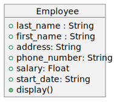

# Assignment-Starter-Repo-Template

TODO: Update the above to your repo name

## Instructions for students

- Implement your solutions in `assignment.py`
- The tests in `test_assignment.py` can be inspected but do not modify them

### Directions - Copy/Pasted from Canvas

The Employee class __init__ method accepts two arguments: first_name and last_name. You are to add four additional attributes:
* address: str
* phone_number: str
* salary: float
* start_date: str

Complete the display method (fruitful) within the Employee class, which returns a string that displays information for the employee in the following format:
* LAST_NAME, FIRST_NAME: {last name, first name here}
* PHONE_NUMBER: {phone number here}
* ADDRESS: {address here}
* START DATE: {start date here}
* SALARY: {salary here}

### Class UML Diagram

